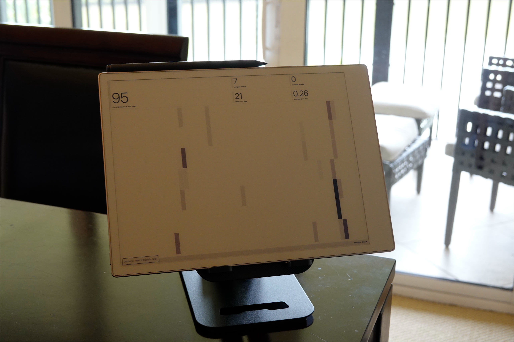

# TRMNL for reMarkable Paper Pro

Run a [TRMNL](https://usetrmnl.com) dashboard on a reMarkable Paper Pro. The
tablet fetches your dashboard on a schedule, keeps the last one cached for when
the network drops, and sleeps in between.

[](https://github.com/NicholasSlattery/Remarkable-TRMNL/actions/workflows/ci.yml)
[](LICENSE)

<p align="center">
  
</p>

This is an unofficial community project. It is not affiliated with or supported
by TRMNL or reMarkable, and a firmware update can break it.

> [!CAUTION]
> **Enabling Developer Mode factory-resets the Paper Pro.** Sync or export
> everything you care about first. Developer Mode also lowers the tablet's
> security, and uninstalling this app does not turn it back off — leaving it
> requires reMarkable's [software recovery](https://support.remarkable.com/s/article/Software-recovery),
> which erases local data again. Read reMarkable's
> [Developer Mode notes](https://support.remarkable.com/s/article/Developer-mode)
> before you start.

## What you need

| | |
|---|---|
| Tablet | reMarkable Paper Pro (`Ferrari`, ARM64) on reMarkable OS 3.26.x or 3.27.x |
| Computer | Windows 10 or 11, x64, for the installer |
| Connection | USB cable (Wi-Fi also works) |
| TRMNL account | A claimed BYOD device and its Device API key, or your own BYOS server over HTTPS |

The installer refuses to run on other models, architectures, and firmware
versions rather than guessing. See [compatibility](docs/compatibility.md).

## Install

1. On the tablet: enable Developer Mode, complete the reset, and note the SSH
   password it shows you. Charge above 20% and connect the USB cable.
2. Download the release ZIP and `SHA256SUMS.txt`, then check the hash matches:

   ```powershell
   Get-FileHash .\TRMNL-for-reMarkable-2.1.0-Windows-x64.zip -Algorithm SHA256
   ```

3. Extract the whole ZIP. Run **TRMNL Installer.exe** with the `payload` folder
   next to it.
4. Leave the address at `10.11.99.1`, paste the SSH password, and click **Find
   my tablet**.
5. Check the model, firmware, and SSH key, then click **Install TRMNL**.
6. On the tablet, open **AppLoad** and tap **TRMNL**.

Windows will warn about an unknown publisher. The installer is signed with a
self-signed certificate, which Windows does not trust automatically — verify the
checksum and read [code signing](docs/code-signing.md) before deciding to run it.

Your SSH password stays in the browser tab and the local installer process. It
is not written to disk or logs, and the installer only listens on `127.0.0.1`.
Longer instructions: [install guide](docs/install.md).

## Connect it to TRMNL

Tap the upper-right corner of the tablet screen, then **Settings**.

For TRMNL cloud, paste the **Device API Key** from your claimed BYOD device's
Developer Perks page and confirm the Device ID matches its Wi-Fi MAC. Do not use
the account token starting with `user_` — that is a different API. Full
walkthrough: [TRMNL setup](docs/trmnl-setup.md).

For a self-hosted BYOS server, choose the custom server option and enter its
HTTPS origin. Plain HTTP is only accepted for a loopback mock on the tablet.

## Using it

| What | Where |
|---|---|
| Controls and Settings | Tap the upper-right corner |
| Refresh, next screen, previous screen | Buttons in the controls panel |
| Front light | Slider, or follow the system brightness |
| Refresh history | **History** in the controls panel |
| Diagnostics | **Diagnostics** — secrets are redacted |
| Back to reMarkable | AppLoad's downward swipe from centre-top, the on-screen button, or hold the upper-left corner for two seconds |

Opening and closing an overlay triggers a local e-ink cleanup. It does not spend
a TRMNL API request.

## Battery

Battery life comes down to how often the tablet wakes, how much it uses Wi-Fi,
and the front light. A static e-ink image costs nothing to keep on screen.

Recommended: leave reMarkable's **Auto-sleep** and **Light sleep** on, turn
**Auto power-off** off, keep TRMNL's **Wake for refresh** on, and use the
longest refresh interval you can live with.

Three settings help further:

- **Refresh less often below 20% battery** stretches the interval up to 4× (max
  6 hours) once the battery is low and the charger is unplugged.
- **Pause scheduled refreshes overnight** stops wakeups inside a window you set.
  The dashboard stays on screen; manual refresh still works.
- **Smooth gradients for the colour panel** dithers images before display, which
  removes the banding that dashboards drawn for bright screens produce. Text and
  flat colour are left alone.

For a real measurement, charge to full, unplug, start the battery test in
Settings, and let it discharge at least 10%. Plugging in invalidates the
estimate rather than skewing it quietly.

## Removing it

Rebooting the tablet always returns to the stock reMarkable interface. Run the
installer again, find your tablet, and pick an action:

| Action | What it does |
|---|---|
| **Reactivate after reboot** | Starts XOVI/AppLoad again without reinstalling |
| **Restore stock interface** | Stops the runtime injection, keeps your data |
| **Uninstall TRMNL** | Removes the app, keeps settings and cache |
| **Uninstall and erase data** | Also removes settings, cache, history, and logs |

None of these turn off Developer Mode. TRMNL only writes under `/home/root` and
never touches your notebooks, documents, or boot partitions — see
[privacy](docs/privacy.md) for the exact paths.

## If something goes wrong

| Problem | Try |
|---|---|
| Tablet not found | Wake and unlock it, plug in directly without a hub, confirm Developer Mode, copy the SSH password again |
| Address won't connect | Use `10.11.99.1` over USB, or the tablet's local IP over Wi-Fi |
| SSH key changed | Don't click past it. Reconnect over USB and confirm it is your tablet before accepting |
| HTTP 401 or 403 | Use the Device API Key from a claimed BYOD device, not a `user_...` token |
| HTTP 429 | Wait — the app honours `Retry-After` |
| Dashboard is monochrome | Check the plugin renders colour; the tablet can't add colour that isn't in the image |
| Gone after reboot | Use **Reactivate after reboot**. Returning to stock on reboot is deliberate |
| Battery drains fast | Longer refresh interval, lower front light, and the battery settings above |

Read [support](.github/SUPPORT.md) before opening an issue, and never paste an API key,
SSH password, or unredacted diagnostic into one.

## Security

The installer binds to localhost only, checks the model, firmware, architecture,
free space, SSH key, payload paths, and checksums before it changes anything,
and remembers the tablet's SSH key so a change is caught on later runs. Your API
key is stored in an owner-only `0600` file, masked in the UI, kept out of logs,
and never sent back to the interface after saving. Remote servers and images
must use HTTPS, credential-bearing cross-origin redirects are refused, and
downloaded images are size- and dimension-checked before decoding. The app
ignores firmware and reset directives from the server.

Report vulnerabilities privately — see [SECURITY.md](.github/SECURITY.md), not a public
issue.

## Documentation

| Topic | |
|---|---|
| Install walkthrough | [docs/install.md](docs/install.md) |
| TRMNL/BYOD setup | [docs/trmnl-setup.md](docs/trmnl-setup.md) |
| Supported devices and firmware | [docs/compatibility.md](docs/compatibility.md) |
| Privacy and stored data | [docs/privacy.md](docs/privacy.md) |
| Windows code signing | [docs/code-signing.md](docs/code-signing.md) |
| Release process | [docs/releasing.md](docs/releasing.md) |
| Validation records | [docs/validation/](docs/validation/) |
| Changes | [CHANGELOG.md](CHANGELOG.md) |
| Third-party components | [THIRD_PARTY_NOTICES.md](THIRD_PARTY_NOTICES.md) |

## Building

Needs Go 1.25.12+, Qt 6.8.2 (`rcc` and `qmllint`), PowerShell 5.1+, Python 3,
and ShellCheck.

```powershell
./scripts/build.ps1
./scripts/build-release.ps1 -Version 2.1.0
```

`build.ps1` runs formatting, tests, `go vet`, the ARM64 cross-build, QML
resource compilation, and bundle validation. `build-release.ps1` also verifies
the pinned runtime hashes, builds the installer, and writes the release ZIP,
SBOM, and checksums under `release/`.

Layout:

- `app/ui/TRMNL.qml` — the AppLoad frontend
- `backend/cmd/trmnl-remarkable` — the ARM64 backend (Device API, scheduling, rendering)
- `installer/` — the localhost Windows installer
- `device/install.sh`, `device/uninstall.sh`, `device/recover-stock.sh` — on-device operations

## Contributing and licence

Issues and pull requests are welcome — start with
[CONTRIBUTING.md](.github/CONTRIBUTING.md) and the
[code of conduct](.github/CODE_OF_CONDUCT.md).

The project is MIT licensed. The installer also redistributes checksum-pinned
XOVI and AppLoad components under their own LGPL/GPL terms; see
[THIRD_PARTY_NOTICES.md](THIRD_PARTY_NOTICES.md).
